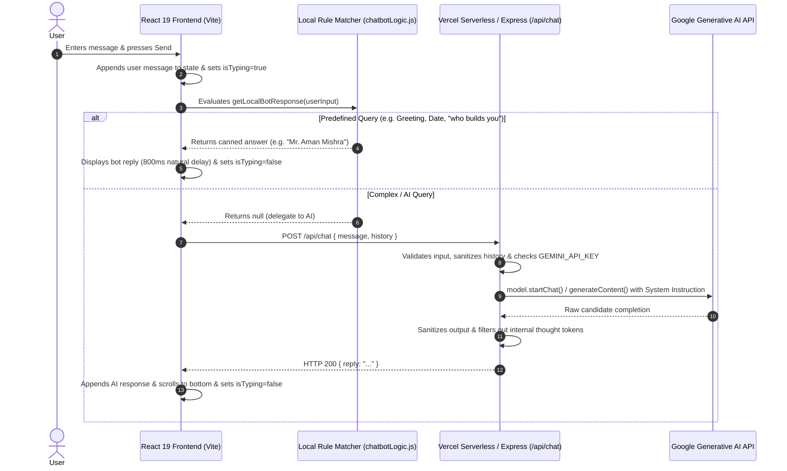

# React Chatbot with Google Gemini AI

A full-stack, production-grade conversational AI assistant built with **React 19**, **Vite**, **Express**, and **Google Gemini AI**. Designed with a warm **Saffron (`#FF9933`)** aesthetic, secure server-side API key architecture, multi-turn dialogue memory, and native **Vercel Serverless Function** deployment.

Created and owned by **Mr. Aman Mishra**.

---

## 🌟 Live Demo

- **Production URL**: [https://basic-chatbot-kappa.vercel.app/](https://basic-chatbot-kappa.vercel.app/)
- **Repository**: [https://github.com/calligraphyguruji/basic-chatbot](https://github.com/calligraphyguruji/basic-chatbot)

---

## 🚀 Key Features

### 1. Hybrid Intelligence Engine
- **Instant Local Rule Matcher**:
  - Zero-latency responses for greetings (`Hello`, `Hi`, `Hey`).
  - Real-time localized calendar date (`today's date`) and time (`what is the time?`).
  - Identity attribution: `"who builds you"` & `"who owns you"` immediately respond with `"Mr. Aman Mishra"`.
  - Smart intent delegation: Location-qualified date/time questions (e.g. *"What time is it in Tokyo?"*) bypass local clock matching and delegate to Google Gemini.
- **Dynamic Google Gemini Integration**:
  - Complex reasoning, software engineering, math, creative writing, and open-ended queries are securely handled by Google Gemini.
  - Multi-turn conversation history ensures contextual continuity across back-and-forth discussions.
  - Automatic dynamic model discovery and fallback across `gemini-flash-latest`, `gemini-3.8-flash`, and `gemini-2.5-flash`.

### 2. Enterprise-Grade Security
- **Strict Server-Side Isolation**: `GEMINI_API_KEY` is never bundled into client-side JavaScript or exposed in Vite builds.
- **Vercel Serverless Architecture**: Client communicates strictly via relative endpoint `POST /api/chat`.
- **Prompt Injection Defense**: Guardrails reject unauthorized system prompt extractions, internal instructions reveals, or hidden reasoning queries.
- **Chain-of-Thought Sanitization**: Dedicated filter strips internal scratchpad tokens (`* Draft 1:`, `* Context:`, `<thought>`, `Self-Correction:`) so only polished, final responses reach the user interface.

### 4. Voice Speaking & Audio Input System
- **Text-to-Speech (TTS) Voice Playback**:
  - Interactive audio speaker buttons next to every bot message bubble.
  - Powered by native browser `window.speechSynthesis` with zero external latency or API costs.
  - Automatically strips markdown formatting (`*`, `**`, code blocks, URLs) for natural audio pronunciation.
  - Real-time active visual wave indicator with one-click stop/resume playback.
- **Speech-to-Text (STT) Microphone Input**:
  - Native microphone speech recognition button right in the input composer.
  - Real-time speech transcription directly into the message composer using `webkitSpeechRecognition`.
  - Animated pulsing saffron glow while the microphone is actively listening.
  - Hands-free, accessible interaction across desktop and mobile devices.

---

## 🏗️ Architecture & Request Lifecycle



---

## 📁 Repository Structure

```
basic-chatbot/
├── api/
│   └── chat.js                 # Vercel Serverless Function (POST /api/chat & GET health)
├── server/
│   └── server.js               # Node.js + Express backend for local development parity
├── src/
│   ├── components/
│   │   ├── Avatars.jsx         # Saffron circular SVG Bot & User icons
│   │   ├── Chatbot.jsx         # Core chat container, scrolling & API orchestration
│   │   ├── ChatInput.jsx       # Controlled text input and Send button form
│   │   ├── ChatMessage.jsx     # User (right) and Bot (left) message bubbles
│   │   └── TypingIndicator.jsx # Bouncing 3-dot typing status bubble
│   ├── utils/
│   │   └── chatbotLogic.js     # Anchored regex intent matcher & local rules
│   ├── App.jsx                 # Application wrapper
│   ├── App.css                 # Fixed composer layout & responsive stylesheet
│   ├── index.css               # Global CSS variables & typography
│   └── main.jsx                # React DOM entry point
├── public/
│   └── favicon.svg             # Application favicon
├── vercel.json                 # Vercel SPA routing & serverless rewrites
├── vite.config.js              # Vite bundler configuration & local /api proxy
├── package.json                # Dependencies, build scripts & metadata
├── .env.example                # Template for environment configuration
└── README.md                   # Project documentation
```

---

## ⚙️ Environment Configuration

### Required Variables

| Variable | Scope | Purpose | Example |
| :--- | :--- | :--- | :--- |
| `GEMINI_API_KEY` | Server-side | Google AI Studio Secret Key | `AIzaSyD...` |
| `GEMINI_MODEL` | Server-side *(Optional)* | Model override (defaults to `gemini-flash-latest`) | `gemini-flash-latest` |
| `PORT` | Local Server *(Optional)* | Port for Express server (defaults to `5001`) | `5001` |
| `CLIENT_ORIGIN` | Express *(Optional)* | Allowed CORS origin for standalone backends | `https://basic-chatbot-kappa.vercel.app` |

> 🔒 **Security Best Practice**: Never prefix secret API keys with `VITE_`. Only public frontend settings should use `VITE_`.

---

## 🛠️ Local Development Setup

### Prerequisites
- **Node.js**: v18.0.0 or higher
- **npm**: v9.0.0 or higher
- **Google Gemini API Key**: Get a free key from [Google AI Studio](https://aistudio.google.com/app/apikey).

### 1. Clone & Install
```bash
git clone https://github.com/calligraphyguruji/basic-chatbot.git
cd basic-chatbot
npm install
```

### 2. Configure Environment
Create a `.env` file in the root directory:
```bash
cp .env.example .env
```
Populate `.env`:
```env
GEMINI_API_KEY=your_actual_gemini_api_key
GEMINI_MODEL=gemini-flash-latest
PORT=5001
```

### 3. Run Locally
Open two terminal windows:

**Terminal 1 (Backend Express Server):**
```bash
npm run server
# Listening on http://localhost:5001
```

**Terminal 2 (Frontend Vite Dev Server):**
```bash
npm run dev
# Running on http://localhost:5173
```
Open `http://localhost:5173` in your browser. All requests to `/api/*` are automatically proxied to port `5001`.

---

## 🚢 Deployment Guide

### Deploying to Vercel (Recommended)
This repository is configured for zero-config Vercel deployment where both the React frontend and `/api/chat.js` serverless function deploy together:

1. Push your changes to GitHub.
2. In your [Vercel Dashboard](https://vercel.com/dashboard), click **New Project** and import `basic-chatbot`.
3. Leave **Root Directory** as `.` (default).
4. In **Project Settings > Environment Variables**, add:
   - `GEMINI_API_KEY` = *your Google AI Studio key*
   - `GEMINI_MODEL` = `gemini-flash-latest` *(optional)*
5. Click **Deploy**. Vercel will build the frontend assets and mount the serverless function under `/api/chat`.

### Split Deployment (Render Backend + Vercel Frontend)
If hosting the backend on **Render Web Service**:
- **Environment**: Node
- **Root Directory**: `.` (leave blank)
- **Build Command**: `npm install`
- **Start Command**: `node server/server.js`
- **Environment Variables**:
  - `GEMINI_API_KEY` = *your key*
  - `CLIENT_ORIGIN` = `https://basic-chatbot-kappa.vercel.app` (without trailing slash)

---

## 🧪 Testing & Verification

### API Health Check
```bash
curl -s https://basic-chatbot-kappa.vercel.app/api/chat
```
Expected Output:
```json
{
  "status": "ok",
  "hasApiKey": true,
  "model": "gemini-flash-latest",
  "availableModels": ["gemini-flash-latest", "gemini-3.8-flash", "gemini-2.5-flash"]
}
```

### Chat Request Test
```bash
curl -X POST https://basic-chatbot-kappa.vercel.app/api/chat \
  -H "Content-Type: application/json" \
  -d '{"message":"who builds you"}'
```
Expected Output:
```json
{
  "reply": "Mr. Aman Mishra"
}
```

---

## 📜 License
This project is open-source and available under the **MIT License**.
