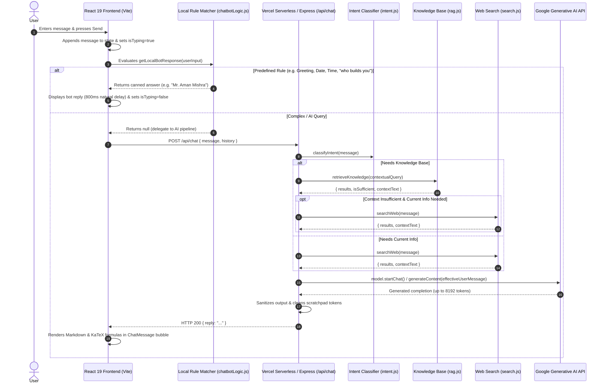

# React Chatbot with Google Gemini AI

A full-stack, production-grade conversational AI assistant built with **React 19**, **Vite**, **Express**, and **Google Gemini AI**. Designed with a warm **Saffron (`#FF9933`)** aesthetic, secure server-side API key architecture, multi-turn dialogue memory, and native **Vercel Serverless Function** deployment.

Created and owned by **Mr. Aman Mishra**.

---

## 🌟 Live Demo

- **Production URL**: [https://basic-chatbot-kappa.vercel.app/](https://basic-chatbot-kappa.vercel.app/)
- **Repository**: [https://github.com/calligraphyguruji/basic-chatbot](https://github.com/calligraphyguruji/basic-chatbot)

---

## 🚀 Key Features

### 1. Hybrid Intelligence Engine
- **Instant Local Rule Matcher**:
  - Zero-latency responses for greetings (`Hello`, `Hi`, `Hey`).
  - Real-time localized calendar date (`today's date`) and time (`what is the time?`).
  - Identity attribution: `"who builds you"` & `"who owns you"` immediately respond with `"Mr. Aman Mishra"`.
  - Smart intent delegation: Location-qualified date/time questions (e.g. *"What time is it in Tokyo?"*) bypass local clock matching and delegate to Google Gemini.
- **Query Intent & Task Classification Engine** (`api/intent.js`):
  - Automatically identifies task types: `FORMULA_SHEET`, `NOTES`, `SUMMARY`, `EXPLANATION`, `COMPARISON`, `MCQ`, `QUIZ`, `STEP_BY_STEP`, `STUDY_PLAN`, `CODE`, and `TABLE`.
  - Seamlessly handles multi-task prompts (e.g. *"Explain photosynthesis in simple language and then give me 10 MCQs with answer key"*).
  - Supplies strict formatting and content instructions tailored to each task type.
- **Local Knowledge Retrieval / RAG Layer** (`api/rag.js`):
  - In-memory structured knowledge base for curriculum subjects (Atomic Structure, Thermodynamics, Photosynthesis, DBMS Normalization).
  - Multilingual Unicode tokenization preserving Hindi and Devanagari script.
  - Relevance token scoring and sufficiency checking; retrieves source knowledge before LLM generation.
- **Live Web Search Grounding** (`api/search.js`):
  - Intelligent fallback when RAG context is insufficient or when queries require current, real-time facts.
  - Fetches and parses clean snippet citations without brittle scraping.
- **Dynamic Google Gemini Reasoning & Generation Layer**:
  - Complex reasoning, multi-task synthesis, and high-capacity token generation (`maxOutputTokens: 8192`).
  - Contextual history preservation resolves pronouns across turns (e.g. *"Now give me its formula sheet"*).
  - Dynamic model discovery and fallback across `gemini-flash-latest`, `gemini-2.5-flash`, `gemini-2.0-flash`, and `gemini-1.5-flash`.

### 2. Rich Markdown & Mathematical LaTeX Rendering
- **Full Markdown Formatting**: Headings, lists, code fences, blockquotes, and responsive tables.
- **LaTeX Math Support**: Formats inline math (`$...$`) and display block math (`$$...$$`) using KaTeX (`react-markdown`, `remark-math`, `rehype-katex`).
- **Auto-Expanding Input Composer**: Replaced single-line input with auto-resizing `<textarea>` supporting `Shift+Enter` for multiline prompts.

### 3. Enterprise-Grade Security
- **Strict Server-Side Isolation**: `GEMINI_API_KEY` is never bundled into client-side JavaScript or exposed in Vite builds.
- **Vercel Serverless Architecture**: Client communicates strictly via relative endpoint `POST /api/chat`.
- **Clean Error Sanitization**: Diagnostic errors log to server console while client receives safe, human-readable error messages without leaking internal endpoints.
- **Prompt Injection Defense**: Guardrails reject unauthorized system prompt extractions or internal instructions reveals.
- **Chain-of-Thought Sanitization**: Dedicated filter strips internal scratchpad tokens (`* Draft 1:`, `* Context:`, `<thought>`, `Self-Correction:`) so only polished, final responses reach the user interface.

### 4. Real-Time Web Grounding & Weather
- **Live Weather Observation**:
  - Contextual city or PIN/ZIP code lookup (e.g. `"weather in Noida"`, `"201310"`, `"delhi ka mausam"`).
  - Automatically queries live meteorological data and formats natural temperature, humidity, and condition summaries.
  - Graceful fallthrough: If weather observation fails or question is academic (e.g. atmospheric thermodynamics), request smoothly continues to Gemini.

### 5. Hindi & Hinglish Multilingual Intelligence
- **Trilingual Fluency**: Fully conversant in **English**, **Hindi (हिंदी)**, and **Hinglish** (e.g. `"kaise ho"`, `"tumhe kisne banaya"`, `"aaj mausam kaisa hai"`, `"React kya hota hai"`).
- **Localized Intent Matching**: Understands questions in Latin and Devanagari script for identity, greetings, date, time, and creator attribution.
- **Accurate Attribution**: Directly answers `"Mr. Aman Mishra"` in both English and Hindi/Hinglish inquiries.

### 6. Voice Speaking & Audio Input System
- **Text-to-Speech (TTS) Female Voice Playback**:
  - Interactive audio speaker buttons next to every bot message bubble.
  - Automatically selects high-quality female voices (e.g. *Veena*, *Lekha*, *Google Hindi*, *Samantha*, *Microsoft Aria/Swara*).
  - Strips markdown formatting and LaTeX math symbols for natural audio speech synthesis.
- **Speech-to-Text (STT) Microphone Input**:
  - Native microphone speech recognition button right in the input composer.
  - Real-time speech transcription directly into the message composer using `webkitSpeechRecognition`.
  - Configured for `en-IN` to naturally recognize Hinglish expressions, Indian names, and English queries.

---

## 🏗️ Architecture & Request Lifecycle



---

## 📁 Repository Structure

```
basic-chatbot/
├── api/
│   ├── chat.js                 # Vercel Serverless Function (POST /api/chat & GET health)
│   ├── intent.js               # Query intent & task classification engine
│   ├── rag.js                  # In-memory curriculum RAG knowledge retriever
│   └── search.js               # Real-time web search fallback orchestrator
├── server/
│   └── server.js               # Node.js + Express backend for local development parity
├── src/
│   ├── components/
│   │   ├── Avatars.jsx         # Saffron circular SVG Bot & User icons
│   │   ├── Chatbot.jsx         # Core chat container, scrolling & API orchestration
│   │   ├── ChatInput.jsx       # Multiline auto-expanding textarea with Send & Mic
│   │   ├── ChatMessage.jsx     # Markdown + KaTeX LaTeX message bubbles
│   │   └── TypingIndicator.jsx # Bouncing 3-dot typing status bubble
│   ├── utils/
│   │   ├── chatbotLogic.js     # Anchored regex intent matcher & local rules
│   │   └── speechUtils.js      # TTS with math sanitization & STT voice input
│   ├── App.jsx                 # Application wrapper
│   ├── App.css                 # Fixed composer layout, Markdown & KaTeX stylesheet
│   ├── index.css               # Global CSS variables & typography
│   └── main.jsx                # React DOM entry point with KaTeX CSS bundle
├── tests/
│   └── evaluation.test.js      # 16-point automated acceptance evaluation suite
├── public/
│   └── favicon.svg             # Application favicon
├── vercel.json                 # Vercel SPA routing & serverless rewrites
├── vite.config.js              # Vite bundler configuration & local /api proxy
├── package.json                # Dependencies, build scripts & metadata
├── .env.example                # Template for environment configuration
└── README.md                   # Project documentation
```

---

## ⚙️ Environment Configuration

### Required Variables

| Variable | Scope | Purpose | Example |
| :--- | :--- | :--- | :--- |
| `GEMINI_API_KEY` | Server-side | Google AI Studio Secret Key | `AIzaSyD...` |
| `GEMINI_MODEL` | Server-side *(Optional)* | Model override (defaults to `gemini-flash-latest`) | `gemini-flash-latest` |
| `PORT` | Local Server *(Optional)* | Port for Express server (defaults to `5001`) | `5001` |
| `CLIENT_ORIGIN` | Express *(Optional)* | Allowed CORS origin for standalone backends | `https://basic-chatbot-kappa.vercel.app` |

> 🔒 **Security Best Practice**: Never prefix secret API keys with `VITE_`. Only public frontend settings should use `VITE_`.

---

## 🛠️ Local Development Setup

### Prerequisites
- **Node.js**: v18.0.0 or higher
- **npm**: v9.0.0 or higher
- **Google Gemini API Key**: Get a free key from [Google AI Studio](https://aistudio.google.com/app/apikey).

### 1. Clone & Install
```bash
git clone https://github.com/calligraphyguruji/basic-chatbot.git
cd basic-chatbot
npm install
```

### 2. Configure Environment
Create a `.env` file in the root directory:
```bash
cp .env.example .env
```
Populate `.env`:
```env
GEMINI_API_KEY=your_actual_gemini_api_key
GEMINI_MODEL=gemini-flash-latest
PORT=5001
```

### 3. Run Locally
Open two terminal windows:

**Terminal 1 (Backend Express Server):**
```bash
npm run server
# Listening on http://localhost:5001
```

**Terminal 2 (Frontend Vite Dev Server):**
```bash
npm run dev
# Running on http://localhost:5173
```
Open `http://localhost:5173` in your browser. All requests to `/api/*` are automatically proxied to port `5001`.

---

## 🚢 Deployment Guide

### Deploying to Vercel (Recommended)
This repository is configured for zero-config Vercel deployment where both the React frontend and `/api/chat.js` serverless function deploy together:

1. Push your changes to GitHub.
2. In your [Vercel Dashboard](https://vercel.com/dashboard), click **New Project** and import `basic-chatbot`.
3. Leave **Root Directory** as `.` (default).
4. In **Project Settings > Environment Variables**, add:
   - `GEMINI_API_KEY` = *your Google AI Studio key*
   - `GEMINI_MODEL` = `gemini-flash-latest` *(optional)*
5. Click **Deploy**. Vercel will build the frontend assets and mount the serverless function under `/api/chat`.

### Split Deployment (Render Backend + Vercel Frontend)
If hosting the backend on **Render Web Service**:
- **Environment**: Node
- **Root Directory**: `.` (leave blank)
- **Build Command**: `npm install`
- **Start Command**: `node server/server.js`
- **Environment Variables**:
  - `GEMINI_API_KEY` = *your key*
  - `CLIENT_ORIGIN` = `https://basic-chatbot-kappa.vercel.app` (without trailing slash)

---

## 🧪 Testing & Verification

### API Health Check
```bash
curl -s https://basic-chatbot-kappa.vercel.app/api/chat
```
Expected Output:
```json
{
  "status": "ok",
  "hasApiKey": true,
  "model": "gemini-flash-latest",
  "availableModels": ["gemini-flash-latest", "gemini-3.8-flash", "gemini-2.5-flash"]
}
```

### Chat Request Test
```bash
curl -X POST https://basic-chatbot-kappa.vercel.app/api/chat \
  -H "Content-Type: application/json" \
  -d '{"message":"who builds you"}'
```
Expected Output:
```json
{
  "reply": "Mr. Aman Mishra"
}
```

---

## 📜 License
This project is open-source and available under the **MIT License**.
